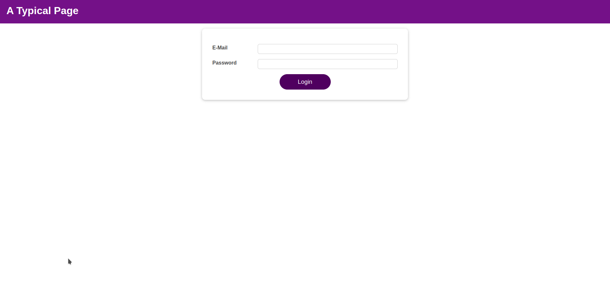
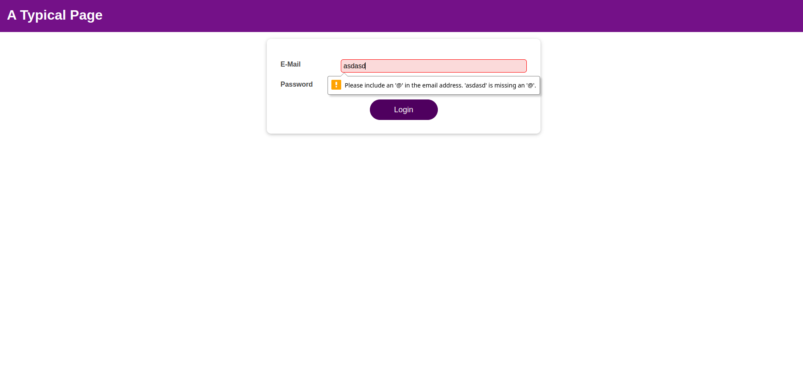
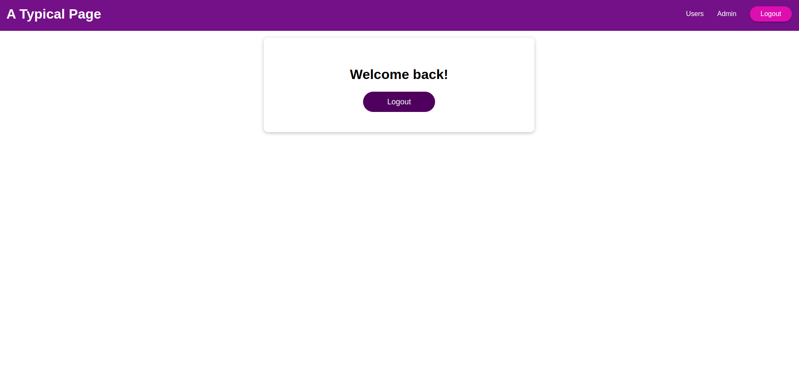

# Login screen - Demo - React
This website will serve as login screen for an application. It will check the email is valid and the password matches a given criteria.

The main learning goals for this project were:
- Learn how to use more complex states
- Learn how to use contexts in React
- Learn how to store data in the browser
- Keep improving my React skills

## Screenshots 📷

## Built with 🛠️
- JavaScript
- HTML
- CSS
- React

## Authors ✒️
- Agustin Aon - [@aon](https://github.com/aon)
